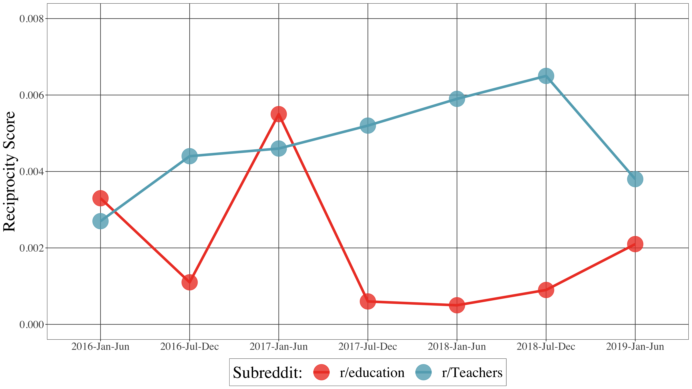
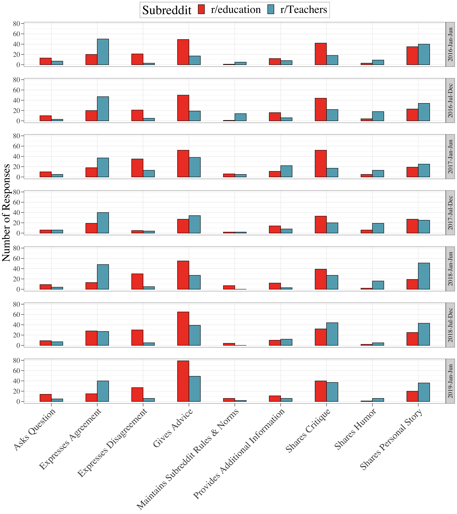

```{r setup, include=FALSE}
usethis::use_git_ignore(c("*.csv", "*.rds"))
options(htmltools.dir.version = FALSE)

library(knitr)
library(tidyverse)
library(xaringan)
library(fontawesome)
```

class: inverse, center, middle

# `r fa("far fa-images", fill = "#fff")`

**View the slides:** [bretsw.github.io/tubingen-lecture](https://bretsw.github.io/tubingen-lecture)

---

class: inverse, center, middle

# `r fa("fab fa-reddit", fill = "#fff")` <br><br> Reddit Background

---

# `r fa("fab fa-reddit", fill = "#fff")` Reddit Background

```{r, out.width = "320px", echo = FALSE, fig.align = "center"}
include_graphics("img/reddit-logo.png")
```

--

1. \#7 website in the United States; \#21 in the world ([alexa.com, January 2022](https://www.alexa.com/siteinfo/reddit.com))

--

1. Collection of discussion forums (i.e., **subreddits**)

--

1. Threaded discussions: **posts** and **comments**

--

1. Voting: **+1** or **-1**

---

# `r fa("fab fa-reddit", fill = "#fff")` Reddit Background

```{r, out.width = "320px", echo = FALSE, fig.align = "center"}
include_graphics("img/reddit-logo.png")
```

1. Anonymity

--

1. Moderation

---

# `r fa("fab fa-reddit", fill = "#fff")` Reddit Features

```{r, out.width = "100%", echo = FALSE, fig.align = "center"}
include_graphics("img/reddit-example.jpg")
```

---

# `r fa("fab fa-reddit", fill = "#fff")` Teaching-related Subreddits

```{r, out.width = "320px", echo = FALSE, fig.align = "center"}
include_graphics("img/reddit-logo.png")
```

--

- Education in general (e.g., r/education)

--

- Education level (e.g., r/highereducation)

--

- Subject area (e.g., r/historyteachers, r/matheducation, r/MusicEd)

---

# `r fa("fab fa-reddit", fill = "#fff")` Example Thread

```{r, out.width = "100%", echo = FALSE, fig.align = "center"}

```

### [I found my teacher’s Twitter.](https://www.reddit.com/r/Teachers/comments/jyji92/i_found_my_teachers_twitter/)

--

**What questions come to mind? What would you want to study? How?**

---

class: inverse, center, middle

# `r fa("fas fa-dice-one", fill = "#fff")` `r fa("fas fa-dice-two", fill = "#fff")` `r fa("fas fa-dice-three", fill = "#fff")` `r fa("fas fa-dice-four", fill = "#fff")` `r fa("fas fa-dice-five", fill = "#fff")` <br><br> Five Examples

---

# `r fa("fab fa-reddit", fill = "#fff")` Five Examples

### `r fa("fas fa-dice-one", fill = "#782F40")` Four Subreddits

<br>

### `r fa("fas fa-dice-two", fill = "#782F40")` Across Time

<br>

### `r fa("fas fa-dice-three", fill = "#782F40")` Discourse Analysis

<br>

### `r fa("fas fa-dice-four", fill = "#782F40")` Higher Ed

<br>

### `r fa("fas fa-dice-five", fill = "#782F40")` COVID-19

---

class: inverse, center, middle

# `r fa("fas fa-dice-one", fill = "#fff")` <br><br> Study \#1 <br> Four Subreddits

https://doi.org/10.1080/15391523.2020.1722978

---

# `r fa("fas fa-dice-one", fill = "#fff")` Four Subreddits

```{r, out.width = "640px", echo = FALSE, fig.align = "center"}

```

---

# `r fa("fas fa-dice-one", fill = "#fff")` Four Subreddits

```{r, out.width = "100%", echo = FALSE, fig.align = "center"}

```

```{r, out.width = "100%", echo = FALSE, fig.align = "center"}

```

---

# `r fa("fas fa-dice-one", fill = "#fff")` Four Subreddits

```{r, out.width = "100%", echo = FALSE, fig.align = "center"}

```

---

# `r fa("fas fa-dice-one", fill = "#fff")` Four Subreddits

```{r, out.width = "100%", echo = FALSE, fig.align = "center"}

```

---

class: inverse, center, middle

# `r fa("fas fa-dice-two", fill = "#fff")` <br><br> Study \#2 <br> Across Time

https://doi.org/10.1111/bjet.13051

---

# `r fa("fas fa-dice-two", fill = "#fff")` Across Time

```{r, out.width = "480px", echo = FALSE, fig.align = "center"}

```

---

# `r fa("fas fa-dice-two", fill = "#fff")` Across Time

### Rise and Fall of Myspace

```{r, out.width = "600px", echo = FALSE, fig.align = "center"}

```

[*Image source: Business Insider (2011)*](https://www.businessinsider.com/chart-of-the-day-the-fall-of-myspace-2011-6)

---

# `r fa("fas fa-dice-two", fill = "#fff")` Across Time

```{r, out.width = "600px", echo = FALSE, fig.align = "center"}
include_graphics("img/teacher.jpg")
```

--

### Purpose: Compare two subreddits over time:

--

[**r/Teachers**](https://www.reddit.com/r/Teachers/) and [**r/education**](https://www.reddit.com/r/education/)

---

# `r fa("fas fa-dice-two", fill = "#fff")` Across Time

```{r, out.width = "600px", echo = FALSE, fig.align = "center"}
include_graphics("img/teacher.jpg")
```

[**r/Teachers**](https://www.reddit.com/r/Teachers/) and [**r/education**](https://www.reddit.com/r/education/)

- Both  part of the Reddit Education Network  (16 subreddits)

---

# `r fa("fas fa-dice-two", fill = "#fff")` Across Time

```{r, out.width = "600px", echo = FALSE, fig.align = "center"}
include_graphics("img/teacher.jpg")
```

[**r/Teachers**](https://www.reddit.com/r/Teachers/) and [**r/education**](https://www.reddit.com/r/education/)

- Highest subscription of teaching-related subreddits
  - **r/Teachers:** 192,000 subscribers at the time of study:
  - **r/education:** 119,000 subscribers at the time of study

---

# `r fa("fas fa-dice-two", fill = "#fff")` Across Time

### Affinity spaces framework

```{r, out.width = "480px", echo = FALSE, fig.align = "center"}
include_graphics("img/empty-space.jpg")
```

--

- Individual contributions

--

- Content interactions

--

- Social interactions

---

# `r fa("fas fa-dice-two", fill = "#fff")` Across Time

### Data Collection

```{r, out.width = "240px", echo = FALSE, fig.align = "center"}
include_graphics("img/reddit-logo.png")
```

--

- **3.5 years** (42 months): from January 1, 2016 to June 30, 2019

--

- **r/Teachers:** 696,660 contributions from 55,148 contributors
  - 54,933 posts and 641,727 responses 

--

- **r/education:** 339,618 contributions from 43,711 contributors
  - 252,340 posts and 87,278 responses 

---

# `r fa("fas fa-dice-two", fill = "#fff")` Across Time

### Data Analysis

```{r, out.width = "240px", echo = FALSE, fig.align = "center"}
include_graphics("img/reddit-logo.png")
```

--

- Split data into 7 six-month partitions

--

- **Quantitative analysis** of individual contributions, content interactions, and social interactions

--

- **Qualitative analysis** of topics of conversation and types of discourse in top-ten posts (defined by highest voting scores) in each subreddit, and up to the top-ten responses to each of these

---

# `r fa("fas fa-dice-two", fill = "#fff")` Across Time

### Daily Contributions

```{r, out.width = "100%", echo = FALSE, fig.align = "center"}
include_graphics("img/2-fig1.png")
```

---

# `r fa("fas fa-dice-two", fill = "#fff")` Across Time

### Contributors

```{r, out.width = "100%", echo = FALSE, fig.align = "center"}
include_graphics("img/2-fig2.png")
```

---

# `r fa("fas fa-dice-two", fill = "#fff")` Across Time

### Response Rate

```{r, out.width = "100%", echo = FALSE, fig.align = "center"}
include_graphics("img/2-fig3.png")
```

---

# `r fa("fas fa-dice-two", fill = "#fff")` Across Time

### Thread Length

```{r, out.width = "100%", echo = FALSE, fig.align = "center"}

```

---

# `r fa("fas fa-dice-two", fill = "#fff")` Across Time

### Node Degree (Connectivity)

```{r, out.width = "100%", echo = FALSE, fig.align = "center"}
include_graphics("img/2-fig5.png")
```

---

# `r fa("fas fa-dice-two", fill = "#fff")` Across Time

### Transitivity (Clustering)

```{r, out.width = "100%", echo = FALSE, fig.align = "center"}

```

---

# `r fa("fas fa-dice-two", fill = "#fff")` Across Time

### Reciprocity (Mutuality)

```{r, out.width = "100%", echo = FALSE, fig.align = "center"}

```

---

# `r fa("fas fa-dice-two", fill = "#fff")` Across Time

### Network Visualizations

```{r, out.width = "440px", echo = FALSE, fig.align = "center"}
include_graphics("img/2-fig8.png")
```

---

# `r fa("fas fa-dice-two", fill = "#fff")` Across Time

### Posts - Content Analysis

```{r, out.width = "440px", echo = FALSE, fig.align = "center"}
include_graphics("img/2-fig9a.png")
```

---

# `r fa("fas fa-dice-two", fill = "#fff")` Across Time

### Posts - Content Analysis

```{r, out.width = "440px", echo = FALSE, fig.align = "center"}
include_graphics("img/2-fig9b.png")
```

---

# `r fa("fas fa-dice-two", fill = "#fff")` Across Time

### Responses - Content Analysis

```{r, out.width = "440px", echo = FALSE, fig.align = "center"}

```

---

# `r fa("fas fa-dice-two", fill = "#fff")` Across Time

### Change and Continuity

```{r, out.width = "320px", echo = FALSE, fig.align = "center"}
include_graphics("img/threads.jpg")
```

--

- **r/Teachers:** 

--

  - Individual contributions increased steadily, clustering decreased, mutuality increased, topics consistently included teachers’ lived experiences and pedagogy
  
--

- **r/education:** 

--

  - Posts and posters declined, thread length increased, clustering decreased, mutuality increased, topics consistently included education policy and societal factors
  
---

# `r fa("fas fa-dice-two", fill = "#fff")` Across Time

### Distinct Purposes

```{r, out.width = "440px", echo = FALSE, fig.align = "center"}
include_graphics("img/social-media.jpg")
```

--

- **r/Teachers:** a conversational space

--

  - many responses, long threads, educators' lived experiences

--

- **r/education:** a bulletin board space

--

  - many posts, few responses, more content-focused

---

# `r fa("fas fa-dice-two", fill = "#fff")` Across Time

### Significance

```{r, out.width = "360px", echo = FALSE, fig.align = "center"}

```

- Educators' self-directed learning is tied to context and has a temporal dimension

--

- Need to advise aspiring educators how best to combine different spaces for maximum effect

--

- There is value to anonymous spaces for educators

--

  - Example: Place to vent and unburden emotions from COVID-19 disruptions and frustrations

---

# `r fa("fas fa-dice-two", fill = "#fff")` Across Time

### Conclusions

```{r, out.width = "440px", echo = FALSE, fig.align = "center"}
include_graphics("img/across-time-full.jpg")
```

--

- Self-directed learning on Reddit is different than visiting a library

--

- Educators must work to become critical consumers of ideas and materials encountered in online spaces 

--

- Educators, instructional designers, and scholars must continue to reflect upon and analyze both opportunities and challenges of self-directed learning in the complex ecologies of social media spaces

---

class: inverse, center, middle

# `r fa("fas fa-dice-three", fill = "#fff")` <br><br> Study \#3 <br> Discourse Analysis

https://doi.org/10.1016/j.tate.2021.103371 

---

# `r fa("fas fa-dice-three", fill = "#fff")` Discourse Analysis

```{r, out.width = "480px", echo = FALSE, fig.align = "center"}

```

--

**r/Teachers:** 

--

- a conversational space `r fa("fas fa-arrow-right", fill = "#782F40")` a teachers lounge

---

# `r fa("fas fa-dice-three", fill = "#fff")` Discourse Analysis

```{r, out.width = "480px", echo = FALSE, fig.align = "center"}

```

**r/education:** 

--

- a bulletin board space `r fa("fas fa-arrow-right", fill = "#782F40")` a debate hall

---

# `r fa("fas fa-dice-three", fill = "#fff")` Discourse Analysis

```{r, out.width = "100%", echo = FALSE, fig.align = "center"}
include_graphics("img/3-fig1.png")
```

---

# `r fa("fas fa-dice-three", fill = "#fff")` Discourse Analysis

```{r, out.width = "100%", echo = FALSE, fig.align = "center"}

```

---

class: inverse, center, middle

# `r fa("fas fa-dice-four", fill = "#fff")` <br><br> Study \#4 <br> Higher Ed

(article coming soon)

---

# `r fa("fas fa-dice-four", fill = "#fff")` Higher Ed

```{r, out.width = "540px", echo = FALSE, fig.align = "center"}
include_graphics("img/4-fig1.png")
```

---

# `r fa("fas fa-dice-four", fill = "#fff")` Higher Ed

```{r, out.width = "360px", echo = FALSE, fig.align = "center"}
include_graphics("img/4-fig2.png")
```

---

class: inverse, center, middle

# `r fa("fas fa-dice-five", fill = "#fff")` <br><br> Study \#5 <br> COVID-19

(collection in process: https://github.com/bretsw/reddit-covid)

---

# `r fa("fas fa-dice-five", fill = "#fff")` COVID-19

```{r, out.width = "100%", echo = FALSE, fig.align = "center"}

```

--

Analysis with [LIWC](https://liwc.wpengine.com/)?

---

class: inverse, center, middle

# `r fa("fas fa-plug", fill = "#fff")` <br><br> Data Sources

---

# `r fa("fas fa-plug", fill = "#fff")` Data Sources

```{r, out.width = "520px", echo = FALSE, fig.align = "center"}

```

--

- [Google Big Query](https://console.cloud.google.com/bigquery)

--

- The Python Reddit API Wrapper ([PRAW](https://praw.readthedocs.io/en/stable/))

--

- [RedditExtractoR](https://rpubs.com/mswofford/redditAPI)

--

- [Dr. BSW's custom R code](https://github.com/bretsw/reddit-covid/blob/main/local-functions.R) for working with the Reddit API

---

class: inverse, center, middle

# `r fa("fas fa-dice-one", fill = "#fff")` `r fa("fas fa-dice-two", fill = "#fff")` `r fa("fas fa-dice-three", fill = "#fff")` `r fa("fas fa-dice-four", fill = "#fff")` `r fa("fas fa-dice-five", fill = "#fff")` <br><br> Wrapping Up

---

# `r fa("fab fa-reddit", fill = "#fff")` Two Final Points

### `r fa("fas fa-dice-one", fill = "#782F40")` Four Subreddits

<br>

### `r fa("fas fa-dice-two", fill = "#782F40")` Across Time

<br>

### `r fa("fas fa-dice-three", fill = "#782F40")` Discourse Analysis

<br>

### `r fa("fas fa-dice-four", fill = "#782F40")` Higher Ed

<br>

### `r fa("fas fa-dice-five", fill = "#782F40")` COVID-19

--

<hr>

1. Reddit is a huge platform and hugely understudied

--

2. Combination of anonymity + moderation make subreddits **very** interesting

---

class: inverse, center, middle

# `r fa("far fa-question-circle", fill = "#fff")` <br><br> Questions

<hr>

`r fa("envelope", fill = "white")` [bret.staudtwillet@fsu.edu](mailto:bret.staudtwillet@fsu.edu) | `r fa("twitter", fill = "white")` [@bretsw](https://twitter.com/bretsw) | `r fa("globe", fill = "white")` [bretsw.com](http://bretsw.com)